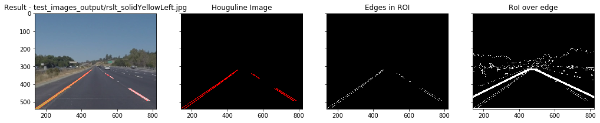
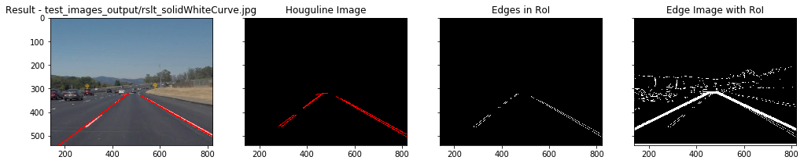
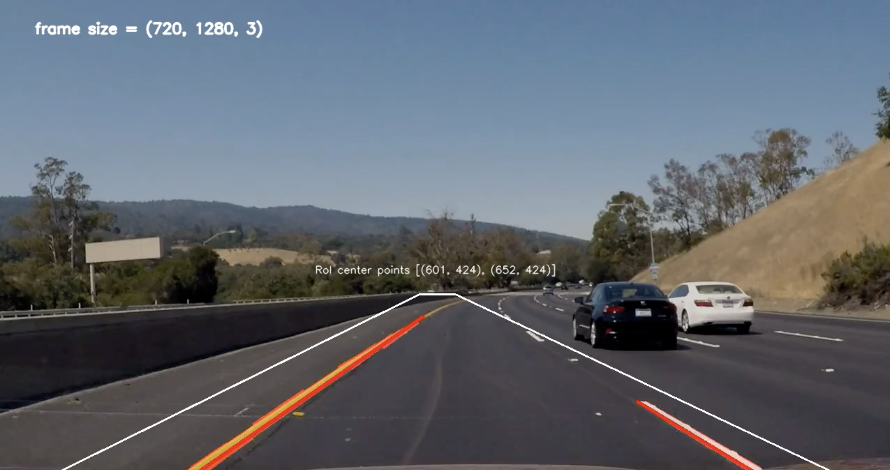
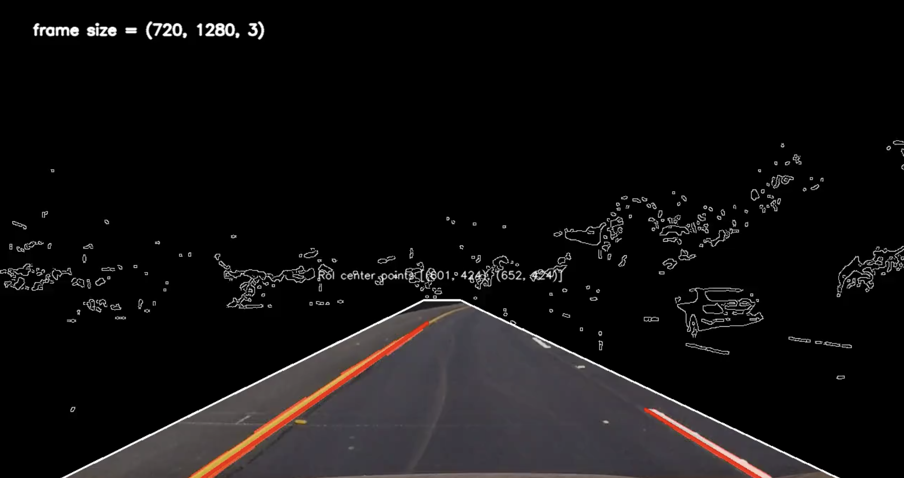

# **Finding Lane Lines on the Road** 

---

#### Finding Lane Lines on the Road

##### Goal:

Lane recognition plays an important role in ADAS and self driving car.
This project demonstrates 

1. a simple lane recognition algorithm given a road image.
2. applying the algorithm to frames of given videos.

---

#### Approach:

#### 1. Lane recognition pipeline

Following image shows the conceptual pipeline of the lane recognition 


(Start from right to left)

##### Base steps

* Given a road image, we apply gaussian filter to reduce noise
* Apply generate canny edge detection 
* Set a image mask to consider only the ROI ( region of interest )
* Apply hough transformation to get line segments 
* Display overlayed hough lines as lane see draw_lines() function.


##### Drawing extrapolated lane line

Given the base steps, we get disconnected lane lines.
To get the extrapolated lane we apply following steps 
( implemented in draw_lines() see P1_solution.ipynb )

* Rough clustering of hough lines 


(individual hough lines visualized in different colors)

In this project, we apply a simple rule to cluster candidate lines of left_lane and right_rane 

As the origin of the image coordinate starts from top left corner

Candidates for the left lanes are those with slope under 0, and likewise, cadidates for the right lanes are those with slope greater than 0. 

```python
    # 1. Cluster lines into two groups ( left and right )
    for line in lines:
        for x1,y1,x2,y2 in line:
            slope = get_slope(x1,y1,x2,y2)
            if slope < 0 : 
                left_lane_lines.append([x1,y1,x2,y2,slope])
            else :
                right_lane_lines.append([x1,y1,x2,y2,slope])
```

* Filter out outliers 

Lanes can be considered to be dominant lines in an image.
Therefore, majority of the houghline segment should have similar slope.

While driving on the road the lanes can be considered to be diagonal lines. Thus, we also filter out dominant horizontal hough lines by applying filtering of ( 0 ~ 15 degree ) slopes.

```python
def get_extrapolated_line(lines,h,w):
    '''
    lines = [[ x1,y1,x2,y2,slope]...]
    '''
    l = np.array(lines) 
    # filter slopes in range of ( 0 ~ 15 degree)
    l = l[abs(l[:,4]) > 0.15]
    :
```

Then we compute mean slope and standard deviation and just filter out line segment that are outside of the std.

```python
def get_extrapolated_line(lines,h,w):
      :
    lslopes = l[:,4].ravel()
    lslope_mean = lslopes.mean()
    lslope_std = lslopes.std()

    l = l[abs(l[:,4] - lslope_mean) < lslope_std ]
```

* Applying line model ( y = ax + b )

slope : Now given filtered out candidate lane lines, we calculate average slope. 

```python
avg_slope = l[:,4].ravel().mean()
```

near center x and y point : given hough line candidates we pick the nearest point to the center of the image.

```phython
    center_y = l[:,[1,3]].ravel().min()
    center_x = l[:,[0,2]].ravel().min() if avg_slope >= 0 else l[:,[0,2]].ravel().max()
```

Given line equation y = ax + b, now we can calculate the other end point of the line lying on the bottom image. 

```python
def get_extrapolated_line(lines,h,w):
     :
    #####################################################
    # Origin (0,0) : upper left corner 
    # right_lane = slope > 0  |  left_lane = slope < 0 
    # y = slope * x + b 
    #####################################################
    b = center_y - (avg_slope * center_x)
    bottom_y = h # image height
    bottom_x = ( bottom_y - b ) / avg_slope 
    
    return int(bottom_x), int(bottom_y), int(center_x), int(center_y)
```

See get_extrapolated_line() function in the notebook ( P1-solution.ipynb )


* Drawing the lines on input frame image 

Given the line points from get_extrapolated_line(), draw the line using opencv line drawing function.

```python
def draw_extrapolated_lines() :
    :
    x1, y1, x2, y2 = get_extrapolated_line(right_lane_lines,img.shape[0],img.shape[1])
    #print (x1, y1, x2, y2)
    cv2.line(img, (x1, y1), (x2, y2), color_map[0], thickness=3)
    :
```

see draw_extrapolated_lines() function in the notebook ( P1-solution.ipynb )

Following shows the result on a sample image



(with extrapolated lane line)


#### 2. Optional Challenge 

As the edge detection and hough transformation works on pixel intensity, it is sensative to noise, reflection and shadow, etc.

Given a challenging sample video "test_videos_output/challenge.mp4", we demonstrate the proposed approach also works fine.

We've applied two changes 

1) We consider yellow and white component in the image to form a gray input for edge detection. 

   ( select color component in HSV color space)

```python
def process_image_ext_line_v2(image):
    hsv = cv2.cvtColor(image, cv2.COLOR_RGB2HSV)
    yellow = cv2.inRange(hsv, (20, 80, 80), (25, 255, 255))
    white = cv2.inRange(hsv, (0, 0, 180), (255, 25, 255))
    gray_from_yellow_white = cv2.bitwise_or(yellow, white)

    blur_gray = gaussian_blur(gray_from_yellow_white, 7)
    edges = canny(blur_gray, 50, 150)
      :
```

2) dynamically setting the ROI polygon ( to cope with different frame size )

```python
    ratio_center_x_left = 0.47
    ratio_center_x_right = 0.51
    ratio_center_y_heighgt = 0.59
    
    center_x_left = int(imshape[1]*ratio_center_x_left)
    center_x_right= int(imshape[1]*ratio_center_x_right)
    center_y_height = int(imshape[0]*ratio_center_y_heighgt)
    
    vertices = np.array([[(0,imshape[0]),(center_x_left, center_y_height), (center_x_right, center_y_height), (imshape[1],imshape[0])]], dtype=np.int32)

```






---

#### 2. Identify potential shortcomings with your current pipeline

* Setting proper RoI

This approach assumes fixed RoI ratio.
depending on driving and road condition, actual road regions can be skipped out 

* Line model 

This approach assumes lane to be a straight forward line.
Given that, it applied a very simple line model.
Naively picked lane ends ( near center of image / vanishing line ) 
Thus, it would introduce errors. 

* Noise / Shadow / Day Night condition 

As the algorithm parameters were set given test dataset,
those parameters need to be adjusted for frames from different scneario.

* And many more 


#### 3. Suggest possible improvements to your pipeline

We could apply more strong denoising filters.

Image segementation tech would help to extract real road region. 
For example we could apply color segmentation, etc. 

Given the segmented region, we could pose adjusted ROI. 

To cope with shadowing, 
we could make a region color model by cummulating region of previous frames. 

Given the hough lines, we could also cosider lane as a connected polygon of lines. 
We could apply better line fitting algorithm, etc.
